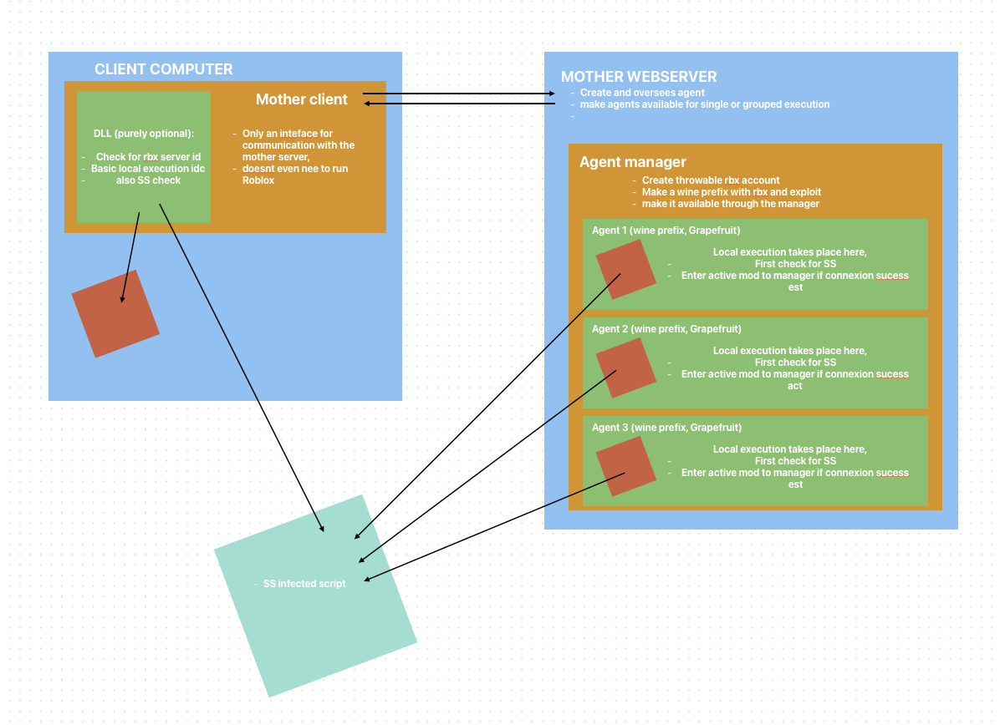

# Mother Project

English version of the README.

Pour la version française, voir [README.fr.md](README.fr.md)



---

**Mother Project** is a macOS suite enabling the execution and management of local scripts in Roblox through a client-server ecosystem. It combines a user interface, isolated agents, and Lua scripts to interact with game instances.

The project consists of four main components: `motherLIB`, `motherCLI`, `motherSS`, and `motherSERVER`.

---

## Architecture and Object Flow

Mother Project uses a **centralized client-server architecture** with local agents capable of executing scripts in isolation. Each component has a specific role and communicates with others to orchestrate commands.

### 1. macOS Client

#### **MotherCLI**
- Swift-based user interface.
- Enables:
  - Sending commands to **motherSERVER**.
  - Managing agents (create, monitor, delete).
  - Injecting **motherLIB** (dylib) into **RobloxPlayer** via `taskForPID`.
- Does not require Roblox to run, but can interact with Roblox via injection.

#### **MotherLIB** (macOS dylib)
- Optional but essential for:
  - **Bytecode manipulation** in Roblox Player.
  - Local script execution.
  - Server ID verification and additional security checks.
- Injected by **motherCLI**, enabling advanced local script execution.

**Client-Local Flow:**
1. User requests **motherCLI** to inject **motherLIB** into RobloxPlayer.
2. **MotherLIB** loads into the process and prepares the player for scripts.
3. Scripts execute locally and report back to the server via agents.

---

### 2. Central Server: **MotherSERVER** (Python)

**MotherSERVER** orchestrates all agents from creation to deletion and handles script execution.

#### Main Functions
- Full agent management:
  - **Creation**: Launches isolated environments with Wine, installs Roblox, and configures the agent.
  - **Monitoring**: Ensures agents are active and ready for commands.
  - **Deletion**: Cleans environments to avoid accumulation.
- Distributes scripts from **motherCLI**.
- Tracks agent status (connected, running, failed).

#### Server-Agent Flow
1. **MotherSERVER** receives a command from **motherCLI**.
2. Selects available agents and sends the command.
3. Each agent executes locally via **motherLIB** (if injection needed) or via **motherSS** in-game.
4. Agent returns execution status and logs to the server.
5. Server updates agent state (active, idle, finished).

#### **Agents**
- Operate in isolated environments (Wine + Roblox).
- Execute scripts without affecting the host system.
- Perform an initial `SS check` for script validity and server connectivity.
- Can execute scripts:
  - **Locally**: via **motherLIB** with bytecode manipulation.
  - **In-game**: via **motherSS** long-polling.

---

### 3. MotherSS (Lua Script)
- Deployed inside a Roblox game.
- Provides **long-polling** to fetch and execute server-sent scripts.
- Contact point for Roblox agents.

---

## Global Flow

1. **User command** via **motherCLI**.
2. **Server distribution**: **motherSERVER** selects agents and sends scripts.
3. **Agent execution**:
   - Locally via **motherLIB** (bytecode manipulation).
   - In-game via **motherSS**.
4. **Status reporting**: Agent sends logs back to server.
5. **Server tracking**: Updates agent state, execution logs.

**Local vs Server distinction:**
- **Local**: Actions in Roblox via **motherLIB**, direct execution, bytecode verification.
- **Server**: Orchestration, agent lifecycle, command distribution, and status tracking.

---

## Example Usage

1. **Local Lua Script Execution**
```bash
$ motherCLI inject --target RobloxPlayerPID
$ motherCLI run --script myScript.lua --agent 1
```

3. **Script Distribution via Server**
```bash
$ motherCLI send --script globalScript.lua --agents all
```

4. **Create/Delete Agents**
```bash
$ motherCLI agent create --count 3
$ motherCLI agent delete --id 2
```

---

## Technologies

- **Swift (macOS)**: `motherCLI`
- **Python**: `motherSERVER`
- **Lua**: `motherSS`
- **C/C++ (macOS dylib)**: `motherLIB`
- **Wine**: Agent isolation

---

## Notes

- `motherLIB` is optional but required for advanced local execution.
- Agents are disposable and isolated.
- Client-server architecture centralizes script distribution.
- Injection and script execution can be abused; this project documents technical functionality only.

---

## Legal Warning

Manipulating scripts in Roblox is subject to Roblox's terms of service and local laws. Use responsibly.


